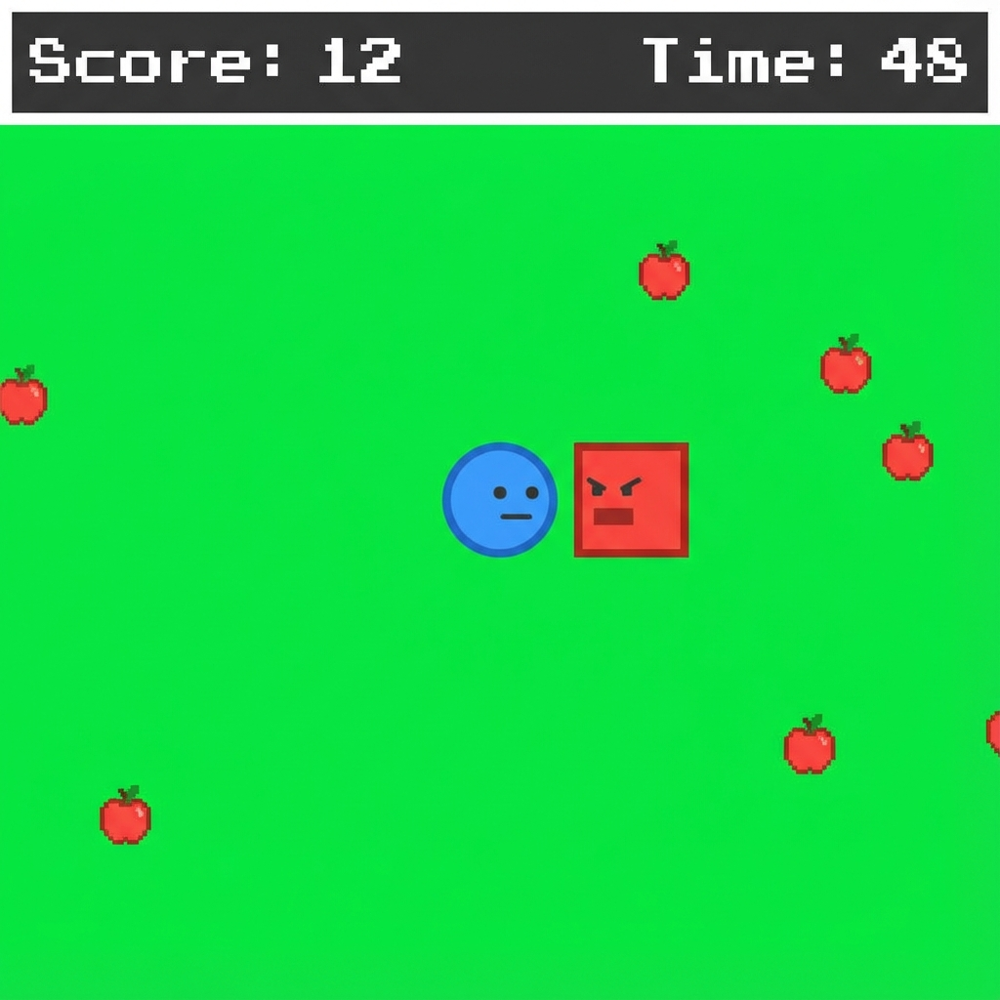

# Chase

**Chase** is a fast-paced, arcade-style web game where you race against time to collect apples while avoiding a relentless pursuer.

I built this game with my second grader to show how to vibe code a web app from a prototype they built in scratch.



## 🎮 How to Play
- **Goal**: Collect as many apples as you can before time runs out!
- **Time**: You start with 60 seconds. Each apple adds 1 second.
- **Avoid**:
    - **The Bad Guy**: A red enemy that chases you. (Touch = Game Over)
    - **Obstacles**: Static gray blocks. (They block your path)
- **Levels**: The background color changes every 10 points!

## ✨ Features
- **Dynamic Level System**: Visual progression with changing backgrounds.
- **High Score**: Your best score is saved locally. Can you beat it?
- **Character Selection**: Choose from 4 unique shapes (Circle, Square, Triangle, Star).
- **Customizable Controls**: Play with **Keyboard** (WASD/Arrows), **Mouse**, or **Touch** (Grab & Drag).
- **Pause System**: Need a break? Press **Escape** or **P** to pause.
- **Settings**: Toggle audio or adjust difficulty (Easy, Medium, Hard).

## 🚀 Launch on GitHub Pages
You can easily host this game for free on GitHub Pages!

1.  **Fork or Push** this repository to your GitHub account.
2.  Go to your repository **Settings**.
3.  Click on **Pages** in the left sidebar.
4.  Under **Build and deployment**:
    -   **Source**: Select `GitHub Actions`.
    -   *Alternatively, if you built locally*: Push the `dist` folder to a branch (e.g., `gh-pages`) and select "Deploy from a branch".
5.  GitHub will build and deploy your game. You'll get a URL like `https://your-username.github.io/chase/`.

## 🛠 Local Development
Want to modify the game?

1.  **Clone the repo**:
    ```bash
    git clone https://github.com/your-username/chase.git
    cd chase
    ```
2.  **Install dependencies**:
    ```bash
    npm install
    ```
3.  **Run locally**:
    ```bash
    npm run dev
    ```
4.  **Build for production**:
    ```bash
    npm run build
    ```
    (This creates the `dist` folder ready for hosting).

## 🧪 Testing
Run the test suite with:
```bash
npm test
```

---
Vibe coded with Google Antigravity. Built with [Vite](https://vitejs.dev/) and TypeScript.
